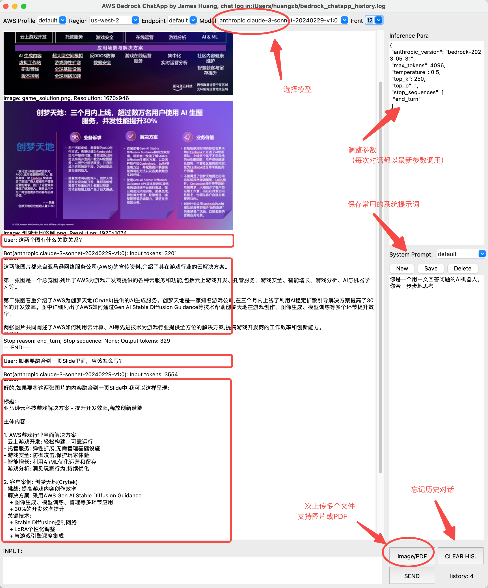

# Bedrock-chatapp-gui

本地运行 GUI(python) 与 Amazon Bedrock 背后的多个大模型进行对话交互，例如 Claude 3(多模态), Titan, AI21, Cohere。会带上上次的对话记录，直到你点Clear清理。并且方便随时调整参数和系统提示词。

* 自动读取本地配置的 AWS Profile，可以选择切换
* 选择支持 Bedrock 的 Region 和模型，注意你的 AWS 账号需要 Request Access 对应的模型。最新版本 bedrock-chatapp-gui.py 支持了 Claude 3，其他老版本和其他模型在以前的旧版本上 bedrock-chatapp-gui-2023.py 支持，如 Claude 2 和 Titan 等。后续会逐步合并统一。
* 自动读取该模型对应的典型参数在右上角，可以手工调整，每单次对话都会调用修改后的参数
* 系统提示词在右下角，每次对话都会带上历史对话，直到你点 CLEAR HIS. 清理历史
* 所有历史对话都会记录到当前运行目录下的 bedrock_chatapp_history.log；每次对话都会带上之前的历史记录给API作为上下文，如果不希望带上历史上下文可以点 CLEAR HIS. 按钮清除对话（不会清除log）
* 对于多模态模型，用 IMAGE 按钮可以上传图片，支持连续上传多张图片，再结合输入文字来一次性提问
* 注意：boto3 >= 1.34.55
* 可选：建议安装最新的Python 3.12 以及更新对应的 tk3.12

参考安装命令

```shell
brew install python@3.12   
brew install python-tk@3.12
pip install -r requirements.txt --break-system-packages
```

* Linux  

运行命令

```shell
git clone https://github.com/hawkey999/bedrock-chatapp-gui
python3 bedrock-chatapp-gui/bedrock-chatapp-gui.py
```

* Windows

除了类似Linux那样通过Python来运行之外，也可以直接[下载](https://github.com/hawkey999/bedrock-chatapp-gui/releases/tag/v2.0)已经打包的exe包运行，无须安装python和相关依赖包

* IAM

如果以前没有用过 AWS CLI （命令行），则需要在 AWS IAM 中创建一个用户，然后把 Access Key 和 Secret Key 配置到本地的 AWS Profile 中，具体步骤可以参考[创建IAM User](https://docs.aws.amazon.com/IAM/latest/UserGuide/id_users_create.html#id_users_create_console)。注意，这个 IAM 用户需要有 Bedrock 的权限。如果没有本地的 AWS Profile，首次运行本程序的时候，会在命令行中提示你输入 Access Key 和 Secret Key ，以及所在的 Region，然后会自动创建一个本地的 AWS Profile。  
如果以前配置过 AWS CLI，则不会再提示配置，而是直接读取本地的 AWS Profile 运行，有多个 Profile 的，可以在界面中切换。


