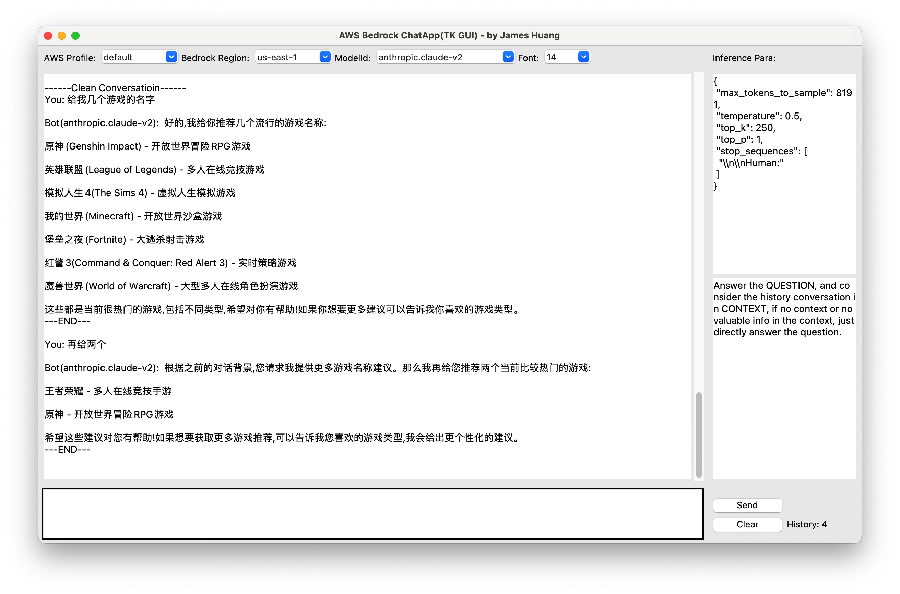

# Bedrock-chatapp-gui

本地运行 GUI(python) 与 Amazon Bedrock 背后的多个大模型进行对话交互，例如 Claude, Titan, AI21, Cohere。会带上上次的对话记录，直到你点Clear清理。并且方便随时调整参数和系统提示词。

* 自动读取本地配置的 AWS Profile，可以选择切换
* 选择支持 Bedrock 的 Region
* 选择模型
* 自动读取该模型对应的典型参数在右上角，可以手工调整，每单次对话都会调用修改后的参数
* 系统提示词在右下角，QUESTION 和 CONTEXT 这两个单词是固定的，其他内容可以自行修改。您的输入会被自动进入 QUESTION 的部分，历史对话会被加入到 CONTEXT 的部分
* 所有历史对话都会记录到当前运行目录下的 bedrock_chatapp_history.log
* Optional: 建议安装最新的Python 3.12 以及更新对应的 tk3.12
* Bedrock 运行需要 python boto3 >= 1.28

参考安装命令

```shell
brew install python@3.12   
brew install python-tk@3.12
pip install boto3 --break-system-packages
```

运行命令

```shell
git clone https://github.com/hawkey999/bedrock-chatapp-gui
python3 bedrock-chatapp-gui/bedrock-chatapp-gui.py
```


